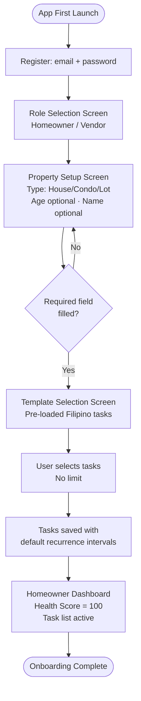
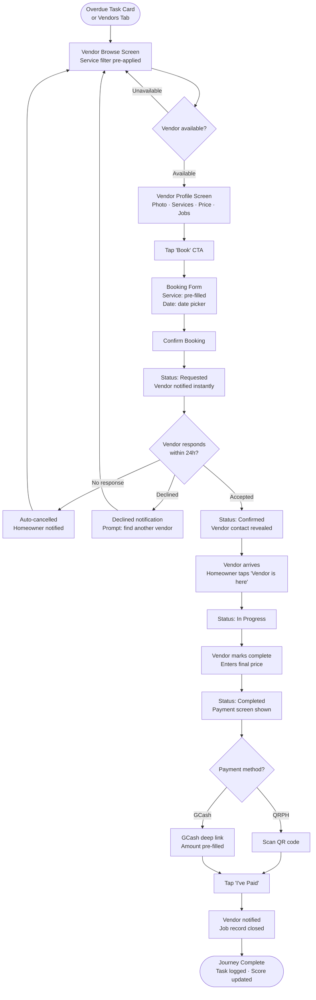
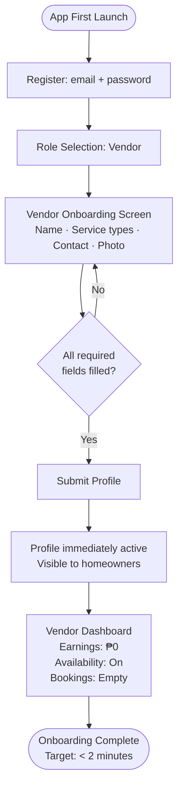
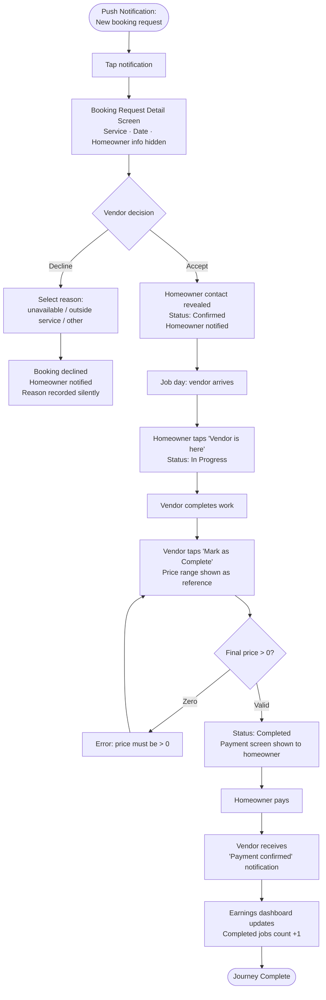
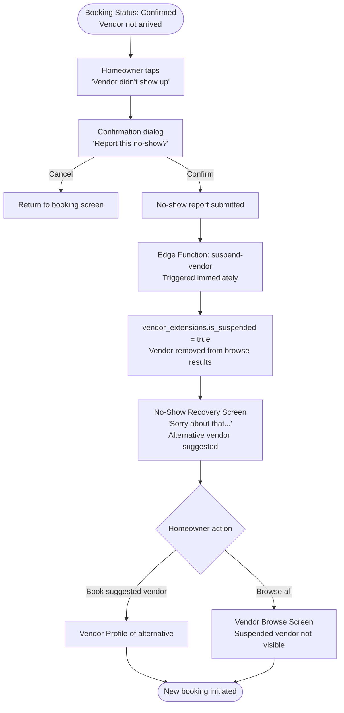

# UX Design Specification spr-house-maintenance-tracker

**Author:** HackathonTeam2
**Date:** 2026-03-04

---

<!-- UX design content will be appended sequentially through collaborative workflow steps -->

## Executive Summary

### Project Vision

SPR House Maintenance Tracker is a Flutter mobile app for the Filipino home services market — a two-sided marketplace where homeowners manage their property maintenance schedule and book trusted local vendors in one tap, while vendors receive instant job notifications and get paid digitally without friction.

### Target Users

**Homeowners**
Filipino property owners (house, condo, or lot) who want a smart maintenance schedule with push reminders and an easy way to book home service professionals. Moderately tech-savvy, mobile-first, motivated by keeping their property in good condition.

**Vendors**
Home service professionals (aircon technicians, pest control, plumbers, electricians, etc.) who want jobs pushed to them with minimal signup friction. Motivated primarily by earnings visibility and ease of getting paid.

### Key Design Challenges

1. Dual-role onboarding — clear homeowner/vendor split from the first screen
2. Booking state machine — 4-status flow must be scannable at a glance for both parties
3. Vendor trust with zero history — new vendors must still appear bookable through profile completeness signals

### Design Opportunities

1. Home Health Score as the emotional hero of the homeowner dashboard
2. Colour-coded task urgency (red/yellow/green) for instant schedule scanning
3. Airbnb-style vendor cards with strong visual trust signals
4. One-tap actions throughout — Book, Accept, Decline, Toggle Availability

## Core User Experience

### Defining Experience

Two parallel core loops unite in the booking lifecycle:
- Homeowners: check schedule → see overdue tasks → find vendor → book in one tap
- Vendors: receive instant notification → accept/decline → complete job → get paid

The booking lifecycle (Requested → Confirmed → In Progress → Completed) is the product's critical path and must work flawlessly end-to-end.

### Platform Strategy

- Flutter mobile app (iOS + Android), touch-first
- Push notifications are a primary interaction surface — tapping a notification must land the user directly on the relevant screen
- Camera access for photo uploads (maintenance logs, profile photos, QRPH codes)
- GCash deep link as the payment exit point
- No offline support — all operations require connectivity

### Effortless Interactions

- One-tap booking from a vendor's profile page
- One-tap Accept / Decline for incoming vendor booking requests
- Availability toggle accessible directly from the vendor dashboard (never buried)
- Push notification → tap → relevant screen (zero extra navigation steps)

### Critical Success Moments

- Homeowner sees their Home Health Score at 100 for the first time
- Vendor receives a booking notification within seconds of a request being submitted
- Full end-to-end demo loop completes without confusion or dead ends
- Homeowner successfully pays via GCash or QRPH scan after job completion

### Experience Principles

1. Speed over depth — every core action reachable in 1–2 taps
2. Most important thing, biggest on screen — Health Score and vendor availability are visual heroes
3. Trust through transparency — price range, completed jobs count, and availability status always visible before booking
4. Instant feedback — every action has immediate visual confirmation; no silent operations

## Desired Emotional Response

### Primary Emotional Goals

**Homeowners:** In control and on top of things — "my home is well-maintained."
**Vendors:** Empowered and professional — "I have a real business tool."

### Emotional Journey Mapping

| Stage | Homeowner Feels | Vendor Feels |
|---|---|---|
| First open | Curious, guided | Sceptical but intrigued |
| Onboarding complete | Set up and ready | Surprised by speed ("that's it?") |
| Core action | Confident (knows price, knows who's coming) | Excited (opportunity arrived) |
| Task/job completed | Proud (score restored) | Satisfied (earnings updated) |
| Something goes wrong | Reassured quickly (no-show → alternatives) | Informed, not penalised |
| Returning to app | Habitual, routine | Motivated by visible earnings |

### Micro-Emotions

- **Confidence** over confusion — every screen tells the user exactly what to do next
- **Trust** over scepticism — price range, job count, and photo visible before booking
- **Accomplishment** over frustration — Health Score returning to 100 is the reward loop
- **Excitement** over anxiety — vendor notification feels like an opportunity, not a demand
- **Reassurance** over abandonment — errors and no-shows have immediate recovery paths

### Design Implications

- Accomplishment → Health Score is bold, prominent, and animated back to 100 on task completion
- Confidence → vendor card shows price range, photo, and jobs count before any commitment
- Urgency without shame → overdue tasks use red highlights, not warning dialogs or blocking modals
- Speed surprise → vendor onboarding must feel so fast it creates a positive "wow" moment
- Recovery → no-show and cancellation screens lead immediately to alternatives, never dead ends

### Emotional Design Principles

1. Celebrate completion — every logged task and completed job gets positive visual feedback
2. Never shame, always nudge — overdue and unavailable states inform, they don't block or alarm
3. Make earnings unmissable — vendor dashboard leads with the earnings number, large and clear
4. Confidence before commitment — show all trust signals on vendor cards before the Book tap

## UX Pattern Analysis & Inspiration

### Inspiring Products Analysis

**Airbnb — Vendor Side Reference**
- Card-first browsing with photo dominant and trust signals (job count, price range, availability) visible before tapping
- Strictly linear booking flow: browse → profile → book → confirm. No dead ends
- Availability is always explicit — unavailable state is visible, not hidden
- Single full-width primary CTA ("Reserve" / "Book") always anchored at screen bottom
- Recovery-first error states — unavailable screens immediately suggest alternatives

**ClickUp / Monday.com — Tracker Side Reference**
- Colour-coded urgency: red = overdue, yellow = due soon, green = on track
- Dashboard leads with a hero metric (score, completion %) — details secondary
- Compact task cards show due date, status, and recurrence without expanding
- Overdue items are sorted to the top automatically — never buried
- Recurring task indicators are subtle but always present on task cards

### Transferable UX Patterns

**Navigation Patterns:**
- Bottom tab bar (3–4 tabs max) — role-specific tabs for homeowner vs vendor
- Deep-link routing: push notification tap → lands directly on relevant screen, bypassing tab navigation entirely

**Interaction Patterns:**
- Airbnb-style vendor cards: photo, name, services, price range, jobs count, availability badge — all visible in the list before tapping in
- ClickUp-style task list: colour-coded rows, overdue at top, upcoming in yellow
- Full-width primary CTA anchored at bottom of screen on all action screens
- Single-tap Accept / Decline with inline confirmation (no full-screen modals)

**Visual Patterns:**
- Large profile photo header on vendor detail screen (Airbnb profile pattern)
- Health Score as a bold hero number on the homeowner dashboard (ClickUp metric card)
- Status chips/badges for booking states and vendor availability
- Colour as the primary urgency signal — red/yellow/green consistent throughout

### Anti-Patterns to Avoid

- Hamburger menus or drawer navigation — buries critical actions
- Nested tabs (tabs within tabs) — confuses role-based navigation
- Modal dialogs for every confirmation — use inline feedback and snackbars instead
- Multi-step forms without a visible progress indicator
- Requiring users to navigate away from their current screen to take a quick action
- Showing empty states without a clear next-step CTA

### Design Inspiration Strategy

**Adopt directly:**
- Airbnb vendor card layout for the vendor browse list
- ClickUp red/yellow/green colour coding for maintenance task urgency
- Bottom tab navigation with role-specific tab sets
- Full-width primary CTA button pattern on all booking/action screens

**Adapt for hackathon simplicity:**
- Airbnb booking flow → simplified to service type + date picker only (no calendar grid view, no guest count)
- ClickUp dashboard → reduced to a single Health Score hero widget (no multi-metric widgets)
- Monday.com board view → simplified to a flat scrollable task list (no Kanban columns for MVP)

**Avoid entirely:**
- Complex filter/sort panels (service type filter only, no advanced search UI)
- Heavy animations and transitions (Flutter Material 3 defaults only)
- Multi-level navigation hierarchies

## Design System Foundation

### Design System Choice

**Flutter Material Design 3** with the "Calm & Trustworthy" colour palette from the team's design reference. Enabled via `useMaterial3: true` in ThemeData.

### Colour Palette

**Primary — Navy & Blue**
- Deep Navy `#1B3A6B` — App bar, headers, bottom nav bar
- Calm Blue `#2E6BC6` — Buttons, links, interactive elements, active tab
- Soft Blue `#D6E4F7` — Card highlights, selected/active chip states

**Neutrals — Backgrounds & Text**
- Off White `#F8F9FB` — Screen backgrounds
- Light Grey `#EEF0F4` — Input fields, chips, dividers
- Mid Grey `#9BA3B2` — Placeholder text, secondary labels
- Dark Charcoal `#1C2230` — Primary body text

**Accents — Status & Feedback**
- Sage Green `#4CAF82` — Health Score 100, task completed, booking confirmed
- Warm Amber `#F4A732` — Upcoming tasks (due ≤7 days), booking pending
- Soft Red `#E05252` — Overdue tasks, vendor suspended badge, errors

### Rationale for Selection

- Zero setup — Material 3 built into Flutter SDK
- Colour palette aligns perfectly with semantic task urgency (green/amber/red)
- Navy/blue primary palette signals trust — critical for a marketplace handling home service bookings and payments
- Clean neutrals (off-white bg, charcoal text) match Airbnb's calm, professional aesthetic

### Implementation Approach

```dart
ThemeData(
  useMaterial3: true,
  colorScheme: ColorScheme.fromSeed(
    seedColor: const Color(0xFF1B3A6B), // Deep Navy
    brightness: Brightness.light,
  ),
)
```

Semantic colours (green/amber/red) applied directly as `Color` constants in `lib/core/constants/app_constants.dart` — not overriding ColorScheme.

### Customisation Strategy

- MVP: Material 3 defaults + palette colours only
- Typography: Material 3 type scale defaults
- Post-hackathon: Custom component library can extend without breaking changes

## Component Strategy

### Design System Components

Flutter Material 3 provides all foundational components (NavigationBar, AppBar, Card, FilledButton, TextField, FilterChip, SnackBar, AlertDialog, DatePicker, Switch, LinearProgressIndicator). No third-party component packages needed.

### Custom Components

#### HealthScoreWidget
**File:** `lib/features/maintenance/presentation/widgets/health_score_widget.dart`
**Purpose:** Hero dashboard element showing the 0–100 property health score
**Anatomy:** Gradient background card · "HOME HEALTH SCORE" label · large bold number · subtitle (overdue count) · thin progress bar
**States:**
- `score: 100` — green gradient (`#2E7D50` → `statusSuccess`), "All tasks on track ✓"
- `score: 70–99` — navy→blue gradient, amber progress bar, overdue count shown
- `score: < 70` — navy→blue gradient, red progress bar, urgent overdue count
**Animation:** Number animates from previous value to new value on score change (`TweenAnimationBuilder`)
**Accessibility:** Semantics label: "Home Health Score: {score} out of 100"

---

#### TaskCardWidget
**File:** `lib/features/maintenance/presentation/widgets/task_card_widget.dart`
**Purpose:** Compact task row with colour-coded urgency left border
**Anatomy:** Coloured left border (3dp) · urgency dot · task name + due date · status chip
**States:**
- `overdue` — `statusError` border + dot, red chip "Overdue"
- `upcoming` — `statusWarning` border + dot, amber chip "Soon"
- `ok` — `statusSuccess` border + dot, green chip "OK"
**Actions:** Tap → task detail screen
**Accessibility:** Semantics: "{task name}, {status}, due {date}"

---

#### VendorCardWidget
**File:** `lib/features/booking/presentation/widgets/vendor_card_widget.dart`
**Purpose:** Airbnb-style vendor listing card showing all trust signals before booking
**Anatomy:** Photo area (80dp height, gradient fallback) · availability badge · name · services · jobs count · price range · Book button
**States:**
- `available: true` — green "● Available" badge, FilledButton enabled
- `available: false` — grey "Unavailable" badge, FilledButton disabled
**Accessibility:** Semantics: "{name}, {services}, {jobs} jobs completed, {price range}, {availability status}"

---

#### BookingStatusStepperWidget
**File:** `lib/features/booking/presentation/widgets/booking_status_stepper_widget.dart`
**Purpose:** Vertical 4-step stepper showing real-time booking lifecycle state
**Anatomy:** Step circle (done ✓ / active / pending) · connector line · step label · step sub-label
**States per step:** done (green ✓) · active (blue filled) · pending (grey)
**Connector line:** green when step below is done; grey otherwise
**Accessibility:** Semantics: "Step {n} of 4: {label}, {status}"

---

#### AvailabilityToggleWidget
**File:** `lib/features/vendor/presentation/widgets/availability_toggle_widget.dart`
**Purpose:** Prominent availability on/off control in vendor dashboard AppBar
**Anatomy:** Coloured dot · "Open" / "Unavailable" label · Flutter Switch in a rounded pill
**Placement:** Always in vendor dashboard AppBar trailing slot — never in settings
**Accessibility:** Semantics: "Availability toggle, currently {on/off}"

---

#### EarningsSummaryWidget
**File:** `lib/features/vendor/presentation/widgets/earnings_summary_widget.dart`
**Purpose:** Gradient earnings hero card on vendor dashboard
**Anatomy:** "NET EARNED THIS MONTH" label · large earnings number · 3-stat row (total jobs / gross / net)
**States:** `hasEarnings: false` — "Complete your first job to start earning!" · `hasEarnings: true` — full breakdown
**Accessibility:** Semantics: "Net earned this month: ₱{amount}. Total jobs: {n}"

---

#### NoShowReportWidget
**File:** `lib/features/booking/presentation/widgets/no_show_report_widget.dart`
**Purpose:** Post-no-show recovery screen with immediate alternative vendor suggestion
**Anatomy:** Apology message · suggested alternative vendor card · "Browse All Vendors" CTA
**States:** `withSuggestion` · `noSuggestion`
**Accessibility:** Semantics: "Vendor did not show up. {alternative vendor} is available to book."

### Component Implementation Strategy

- All custom components are stateless widgets receiving typed model objects as parameters
- No `supabase.from()` calls inside widgets — data sourced from Riverpod providers only
- Semantic colour constants imported from `lib/core/constants/app_constants.dart`
- All components follow `{feature}/presentation/widgets/{name}_widget.dart` naming convention

### Implementation Roadmap

**Phase 1 — Critical for demo:**
- `HealthScoreWidget` — homeowner dashboard (H5)
- `TaskCardWidget` — maintenance task list (H2, H3)
- `VendorCardWidget` — vendor browse (H6)
- `BookingStatusStepperWidget` — booking tracker (H8)

**Phase 2 — Complete vendor side:**
- `AvailabilityToggleWidget` — vendor dashboard (V5)
- `EarningsSummaryWidget` — earnings screen (V6)

**Phase 3 — Polish and recovery flows:**
- `NoShowReportWidget` — can start as plain AlertDialog + navigation, refine after Phase 1–2

## Responsive Design & Accessibility

### Responsive Strategy

**Mobile-only for MVP** — Flutter app targets phone screens on iOS and Android. No tablet or desktop layout needed for hackathon scope.

All screens use single-column scrollable layout with:
- Fixed horizontal padding: 16dp
- Full-width cards and buttons
- `ListView` / `SingleChildScrollView` for vertically scrolling content
- No hardcoded widths — use `double.infinity` for full-width elements
- `Expanded` / `Flexible` for proportional layouts within rows

### Breakpoint Strategy

**No breakpoints required for MVP.** Target range: 360dp–430dp phone width.

All layouts tested on:
- iPhone SE (375pt — smallest common iOS device)
- iPhone 14 Pro (393pt — standard iOS)
- Mid-range Android (360dp–390dp — most common Filipino device segment)

### Accessibility Strategy

**Target: WCAG AA compliance.**

**Already confirmed passing (Visual Foundation step):**
- Deep Navy `#1B3A6B` on white: 9.7:1 ✅ AAA
- Calm Blue `#2E6BC6` on white: 4.6:1 ✅ AA
- Dark Charcoal `#1C2230` on Off White: 15:1 ✅ AAA
- Soft Red `#E05252` on white: 3.9:1 ✅ AA (icons/large text)

**Custom component Semantics requirements:**

| Component | Semantics label |
|---|---|
| `HealthScoreWidget` | "Home Health Score: {score} out of 100" |
| `TaskCardWidget` | "{task name}, {status}, due {date}" |
| `VendorCardWidget` | "{name}, {services}, {jobs} jobs, {price range}, {availability}" |
| `BookingStatusStepperWidget` | "Step {n} of 4: {label}, {status}" |
| `AvailabilityToggleWidget` | "Availability: currently {on/off}" |
| `EarningsSummaryWidget` | "Net earned this month: ₱{amount}" |

**Status colour rule:** Red/amber/green always paired with text label or icon — colour is never the sole indicator of state (WCAG 1.4.1).

### Testing Strategy

**Device testing before demo:**
- iOS: iPhone SE (smallest), iPhone 14 Pro (standard)
- Android: 1 mid-range device (360dp–390dp)

**Accessibility checks (manual, pre-demo):**
- iOS VoiceOver: navigate through core booking flow
- Verify all tap targets comfortable with one thumb
- Confirm no text truncated on iPhone SE width

### Implementation Guidelines

```dart
// ✅ Full-width elements
width: double.infinity

// ✅ Custom widget with semantics
Semantics(
  label: 'Home Health Score: $score out of 100',
  child: HealthScoreCard(score: score),
)

// ✅ Decorative elements excluded
ExcludeSemantics(child: Icon(Icons.circle))

// ✅ Minimum tap target
SizedBox(width: 48, height: 48, child: IconButton(...))

// ❌ Never hardcode screen-specific widths
width: 375 // FORBIDDEN
```

## UX Consistency Patterns

### Button Hierarchy

One primary action per screen maximum.

| Level | Widget | Use | Colour |
|---|---|---|---|
| Primary | `FilledButton` | Book, Accept, Confirm, Submit | `primaryBlue` `#2E6BC6` |
| Secondary | `OutlinedButton` | Decline, Cancel, Skip | `primaryNavy` border |
| Destructive | `OutlinedButton` | Report No-Show, Delete task | `statusError` border + text |
| Tertiary | `TextButton` | Low-emphasis links | `primaryBlue` text |

**Rules:**
- Primary button always full-width, anchored at screen bottom (16dp padding)
- Destructive actions use `OutlinedButton` with `statusError` — never `FilledButton`
- While in-flight: disable button + inline spinner replacing button label
- Button labels: sentence case, verb-first ("Book Carlo" not "Proceed to booking")

### Feedback Patterns

- **Success:** `SnackBar` with `statusSuccess` background, auto-dismisses in 3s
- **Error:** Inline `TextField` `errorText` for forms; `SnackBar` with `statusError` for action failures
- **Loading:** `CircularProgressIndicator.adaptive()` centred for initial load; inline spinner on buttons; `LinearProgressIndicator` at list top for refresh
- **Confirmation (destructive only):** `AlertDialog` — Cancel (TextButton) + Confirm (destructive FilledButton)
- **Never:** Full-screen overlays or bottom sheets for non-destructive actions

### Form Patterns

- Required fields: asterisk (*) in `InputDecoration` label
- Validation on submit only — never on every keystroke
- Error display: `TextField` `errorText` inline below field
- Date input: `showDatePicker()` — no manual text entry
- Image upload: show `CircularProgressIndicator` while uploading; thumbnail on success
- Multi-select service types: `FilterChip` row — chips toggle independently
- Form submit flow: validate → disable button + spinner → success (`SnackBar` + navigate) or error (re-enable + error `SnackBar`)

### Navigation Patterns

**Homeowner NavigationBar:**

| Tab | Icon | Route |
|---|---|---|
| Home | 🏠 | `/homeowner/dashboard` |
| Tasks | 📋 | `/homeowner/tasks` |
| Vendors | 🔍 | `/homeowner/vendors` |
| Bookings | 📅 | `/homeowner/bookings` |

**Vendor NavigationBar:**

| Tab | Icon | Route |
|---|---|---|
| Dashboard | 📊 | `/vendor/dashboard` |
| Bookings | 📋 | `/vendor/bookings` |
| Profile | 👤 | `/vendor/profile` |

- `context.go()` — replaces stack (post-login, post-booking, post-onboarding)
- `context.push()` — adds to stack (vendor profile, task detail, booking detail)
- `Navigator.push()` — **FORBIDDEN**
- Push notification deep-link → `context.go('/specific/route')` bypasses tabs

### Empty States

Every empty state: icon + title + body text + CTA button.

| Screen | Message | CTA |
|---|---|---|
| Task list (new user) | "Add your first task to activate your Health Score" | "Add Task" |
| Vendor browse (filtered) | "No vendors offer this service yet" | "Clear filter" |
| Bookings list | "No bookings yet" | "Find a Vendor" |
| Earnings (no jobs) | "Complete your first job to start earning!" | — |

### Search & Filter Patterns

- `FilterChip` row (horizontal scroll) for service type — "All" deselects others
- `TextField` with search icon prefix for keyword search on vendor browse
- Filter state is local UI state, not persisted between sessions

### Loading & Error States

```dart
ref.watch(vendorListProvider).when(
  data: (vendors) => VendorList(vendors),
  loading: () => const Center(child: CircularProgressIndicator.adaptive()),
  error: (e, _) => ErrorStateWidget(
    message: e.toString(),
    onRetry: () => ref.refresh(vendorListProvider),
  ),
);
```

- Every screen with async data handles all 3 states
- Error state always shows a "Retry" button — never a dead end
- `ErrorStateWidget` is a shared widget in `lib/core/`

## Design Direction Decision

### Design Directions Explored

- Direction 1A: Score-Hero dashboard (gradient card, large number, colour-coded task list)
- Direction 1B: Score-100 celebration state (green gradient, positive reinforcement)
- Direction 2: List-First compact (score as inline row, more tasks visible)
- Direction 3: Airbnb-style vendor card browse list
- Direction 4: Vendor profile with hero photo + stats row + anchored Book CTA
- Direction 5: Vendor dashboard with earnings-hero + availability toggle + booking cards
- Direction 6: Booking status stepper + payment screen + no-show recovery screen

**HTML Showcase:** `_bmad-output/planning-artifacts/ux-design-directions.html`

### Chosen Direction

**Homeowner:** Direction 1A (Score-Hero) — large gradient Health Score card as dashboard centrepiece, colour-coded task list below
**Vendor:** Direction 5 (Earnings-Hero Dashboard) + Direction 3 (Airbnb Card Browse) + Direction 4 (Profile detail)
**Booking:** Direction 6 (Linear stepper + payment screen + no-show recovery)

### Design Rationale

- Score-Hero maximises the emotional reward loop — Health Score at 100 creates pride and habit
- Airbnb-style cards put all trust signals (price, jobs count, availability) visible before commitment
- Earnings-hero on vendor dashboard makes income the primary motivator to keep using the app
- Linear stepper with real-time updates eliminates confusion about booking state for both parties

### Implementation Approach

- All screens use Material 3 `NavigationBar` (4 tabs per role, role-specific tab sets)
- No custom widgets beyond Material 3 components + semantic colour overrides from app_constants.dart
- Screens follow feature-first folder structure exactly as defined in architecture.md

## 2. Core User Experience

### 2.1 Defining Experience

**Homeowner:** "From overdue task to booked vendor in under 30 seconds."
**Vendor:** "A job arrives in your pocket — accept it before someone else does."

These two experiences connect at the booking request: the homeowner's one-tap becomes the vendor's instant notification.

### 2.2 User Mental Model

**Homeowners** approach this like Grab or Klook — pick what you need, pick who does it, they confirm, they come. No phone calls, no price negotiation, no uncertainty. The mental model is: "it just gets done."

**Vendors** approach this like a job-alert app — notification arrives, Accept or Decline in one tap, show up, confirm price, get paid. Simple enough to use between jobs.

**Current pain** (what we're replacing): Facebook group searches, referral chains, phone tag, cash-only payments with no record.

### 2.3 Success Criteria

- Homeowner completes booking in ≤3 taps from the vendor browse screen
- Vendor receives notification within 30 seconds of booking submission
- Booking status updates without the user refreshing or navigating away
- First-time user can complete onboarding (either role) without asking for help
- Full demo loop (task → vendor → book → accept → complete → pay) runs without confusion in front of judges

### 2.4 Novel UX Patterns

No novel patterns required — this is intentional for a hackathon. All interactions use established mobile patterns that Filipino smartphone users already understand from Grab, Shopee, and GCash.

**Our differentiation is execution, not innovation:**
- Fewer steps than competitors (3 taps to book vs. phone calls)
- Price transparency before booking (no price surprise)
- Instant trust enforcement (no-show = immediate suspension)

### 2.5 Experience Mechanics

**Homeowner Booking Flow:**
1. Initiation: Tap "Find a Vendor" from a task card or bottom nav
2. Browse: Scrollable vendor list; service chip pre-selected from task context
3. Profile: Full vendor profile — photo, services, price range, jobs count, Book button
4. Form: 2 fields — service type (pre-filled) + preferred date (date picker)
5. Submit: "Confirm Booking" → status immediately shows "Requested"
6. Live update: Status stepper updates in real-time via Supabase Realtime

**Vendor Response Flow:**
1. Push notification arrives with job type + preferred date
2. Tap notification → lands on booking request detail screen
3. Review homeowner's preferred date and service
4. Single tap: Accept (reveals homeowner contact) or Decline (select reason)
5. On Accept: homeowner notified, booking moves to "Confirmed"

## User Journey Flows

### Journey 1: Homeowner First-Time Onboarding

**Entry point:** App first launch after registration
**Goal:** Property set up, maintenance schedule active, Health Score visible



**Key UX decisions:**
- Role selection is the first fork — homeowner/vendor routes diverge immediately
- Property type is the only required field — friction minimised
- Template screen pre-selects common tasks — user deselects, not selects from scratch
- Dashboard shows score = 100 immediately as reward for completing setup

---

### Journey 2: Homeowner Booking Flow (Defining Experience)

**Entry point:** Overdue task card OR Vendors tab
**Goal:** Vendor booked, status tracked, payment completed



---

### Journey 3: Vendor Fast Onboarding

**Entry point:** App first launch → "I am a Vendor"
**Goal:** Vendor profile active and visible to homeowners in < 2 minutes



**Key UX decisions:**
- 4 fields only — no documents, no location, no verification
- Profile goes live immediately on submit — no review queue
- Dashboard shows availability toggle prominently — first thing vendor sees

---

### Journey 4: Vendor Booking Response + Job Completion

**Entry point:** Push notification for new booking request
**Goal:** Job accepted, completed, final price confirmed, earnings updated



---

### Journey 5: No-Show Enforcement Flow

**Entry point:** Confirmed booking — vendor doesn't arrive
**Goal:** Vendor suspended, homeowner unblocked and rebooked quickly



---

### Journey Patterns

**Navigation Patterns:**
- All journeys start from bottom `NavigationBar` tabs — no deep-link dead ends
- Push notification → `context.go('/deep/path')` — lands on specific screen, bypasses tabs
- Post-action redirects use `context.go()` to replace stack (no back button to completed actions)
- Detail screens use `context.push()` — back button always available

**Decision Patterns:**
- Every destructive action (cancel, no-show report) has a single confirmation dialog
- Auto-cancel and auto-decline run server-side (Edge Functions) — never block UI
- Error states always include a next-step CTA — no dead-end screens

**Feedback Patterns:**
- Booking status changes trigger push notification AND update the in-app stepper via Realtime
- All form submissions show `CircularProgressIndicator.adaptive()` while in flight
- Success actions show a `SnackBar` (not a modal) — non-blocking positive feedback
- Score updates after task completion are animated (number counts up to new value)

### Flow Optimization Principles

1. **Zero dead ends** — every error and rejection screen has an immediate recovery action
2. **Pre-fill wherever possible** — service type carries from task context into booking form
3. **Server handles timers** — 24h auto-cancel runs on pg_cron, never requires user action
4. **Real-time over polling** — Supabase Realtime subscription means status changes appear instantly
5. **Notification is the entry point** — vendor's entire journey can begin and end from push notifications without navigating the app manually

## Visual Design Foundation

### Color System

**Semantic Colour Mapping (Flutter constants in `lib/core/constants/app_constants.dart`):**

```dart
// Primary
static const Color primaryNavy     = Color(0xFF1B3A6B); // App bar, headers, nav
static const Color primaryBlue     = Color(0xFF2E6BC6); // Buttons, CTAs, active tab
static const Color primaryBlueSoft = Color(0xFFD6E4F7); // Selected chips, highlights

// Neutrals
static const Color backgroundApp  = Color(0xFFF8F9FB); // Screen background
static const Color surfaceCard    = Color(0xFFFFFFFF); // Card surface
static const Color divider        = Color(0xFFEEF0F4); // Dividers, input fields
static const Color textSecondary  = Color(0xFF9BA3B2); // Placeholder, secondary labels
static const Color textPrimary    = Color(0xFF1C2230); // Body text

// Semantic / Accent
static const Color statusSuccess  = Color(0xFF4CAF82); // Completed, confirmed, score 100
static const Color statusWarning  = Color(0xFFF4A732); // Upcoming (≤7 days), pending
static const Color statusError    = Color(0xFFE05252); // Overdue, suspended, errors
```

**Material 3 Seed:**
`ColorScheme.fromSeed(seedColor: Color(0xFF1B3A6B))` — Deep Navy seeds the full Material 3 palette; semantic accent colours applied as direct constants, not overriding the generated scheme.

### Typography System

Material 3 default type scale — no custom fonts for MVP.

| Role | Material 3 Token | Use |
|---|---|---|
| Hero number | `displayMedium` bold | Health Score (0–100), earnings total |
| Screen title | `headlineSmall` | AppBar titles, section headers |
| Card title | `titleMedium` semibold | Vendor name, task name |
| Body content | `bodyMedium` | Descriptions, task notes |
| Button label | `labelLarge` | All button text |
| Chip / badge | `labelSmall` | Status chips, availability badge |
| Secondary info | `bodySmall` | Timestamps, job count, price range |

**Tone:** Professional but approachable — sentence case everywhere, no ALL CAPS except badge labels.

### Spacing & Layout Foundation

**Base unit:** 4dp (Material 3 standard)

| Token | Value | Use |
|---|---|---|
| `spacing-xs` | 4dp | Icon-to-label gap |
| `spacing-sm` | 8dp | Within-component padding |
| `spacing-md` | 12dp | Card internal padding |
| `spacing-lg` | 16dp | Screen horizontal margin |
| `spacing-xl` | 24dp | Between sections |
| `spacing-xxl` | 32dp | Major screen section breaks |

**Layout rules:**
- Screen horizontal padding: 16dp on all sides
- Card border radius: 16dp (Material 3 `CardTheme`)
- Bottom nav height: 56dp (Material 3 `NavigationBar`)
- Minimum tap target: 48×48dp (all interactive elements)
- Vendor photo on browse card: 80×80dp rounded square
- Vendor hero photo on profile screen: full width, 200dp height

### Accessibility Considerations

- **Contrast:** Deep Navy `#1B3A6B` on white → 9.7:1 ✅ AAA
- **Contrast:** Calm Blue `#2E6BC6` on white → 4.6:1 ✅ AA
- **Contrast:** Soft Red `#E05252` on white → 3.9:1 ✅ AA (large text/icons)
- **Contrast:** Dark Charcoal `#1C2230` on Off White `#F8F9FB` → 15:1 ✅ AAA
- All interactive elements ≥48×48dp tap target
- `CircularProgressIndicator.adaptive()` — platform-native loading states
- Status colours (red/amber/green) never used as the sole indicator — always paired with text label or icon

## Design Inspiration References

- **Vendor side** → Airbnb: profile cards, trust signals, booking flow, one-tap CTAs
- **Tracker side** → ClickUp / Monday.com: task lists, status indicators, overdue highlighting, recurring tasks, dashboard health views

## Design Philosophy

- **Hackathon-first**: Simple, straightforward, demo-ready — no over-engineering
- Prioritise clarity and speed of interaction over visual complexity
- No custom animations or transitions beyond Flutter Material 3 defaults
- Every screen must be immediately understandable without explanation
